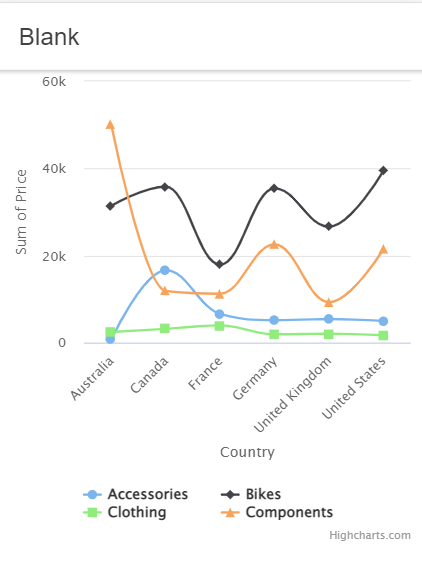

# :zap: Ionic Angular Orienter

* App created using the [Ionic framework](https://ionicframework.com/docs) and the [Angular directive for Flexmonster Pivot Table & Charts](https://www.npmjs.com/package/ng-flexmonster).
* **Note:** to open web links in a new window use: _ctrl+click on link_


## :page_facing_up: Table of contents

* [:zap: Ionic Angular Orienter](#zap-ionic-angular-orienter)
  * [:page_facing_up: Table of contents](#page_facing_up-table-of-contents)
  * [:books: General info](#books-general-info)
  * [:camera: Screenshots](#camera-screenshots)
  * [:signal_strength: Technologies](#signal_strength-technologies)
  * [:floppy_disk: Setup](#floppy_disk-setup)
  * [:computer: Code Examples](#computer-code-examples)
  * [:cool: Features](#cool-features)
  * [:clipboard: Status & To-do list](#clipboard-status--to-do-list)
  * [:clap: Inspiration](#clap-inspiration)
  * [:file_folder: License](#file_folder-license)
  * [:envelope: Contact](#envelope-contact)

## :books: General info

* Flexmonster is an open-source reporting tool that provides JavaScript tool for data visualization. The solution allows users to handle data sets, OLAP cubes and SQL databases with files up to 100 MB.
* Displays Highcharts image from the Flexmonster library

## :camera: Screenshots



## :signal_strength: Technologies

* [Ionic v6](https://ionicframework.com/)
* [Angular v15](https://angular.io/)
* [Ionic/angular v6](https://www.npmjs.com/package/@ionic/angular)
* [Flexmonster for Angular v2](https://www.npmjs.com/package/ng-flexmonster)
* [Highcharts v10](https://www.npmjs.com/package/highcharts)

## :floppy_disk: Setup

* Run `npm i` to install dependencies
* To start the server on _localhost://8100_ type: 'ionic serve'

## :computer: Code Examples

* `home.page.ts` function to draw highchart using flexmonster

```typescript
     drawChart() {
        this.pivot.flexmonster.highcharts?.getData(
            {
                type: "spline"
            },
            (data: Flexmonster.GetDataValueObject) => {
                Highcharts.chart('highcharts-container', <Highcharts.Options>data);
            }
        );
    }
```

## :cool: Features

* na

## :clipboard: Status & To-do list

* Status: Basic chart working
* To-do: Fix menu. Add charts.

## :clap: Inspiration

* [Flexmonster usage examples](https://www.flexmonster.com/doc/usage-examples-angular/)
* [Flexmonster examples with Highcharts](https://github.com/flexmonster/pivot-angular/tree/master/src/app/examples/with-highcharts)

## :file_folder: License

* This project is licensed under the terms of the MIT license.

## :envelope: Contact

* Repo created by [ABateman](https://github.com/AndrewJBateman), email: gomezbateman@yahoo.com